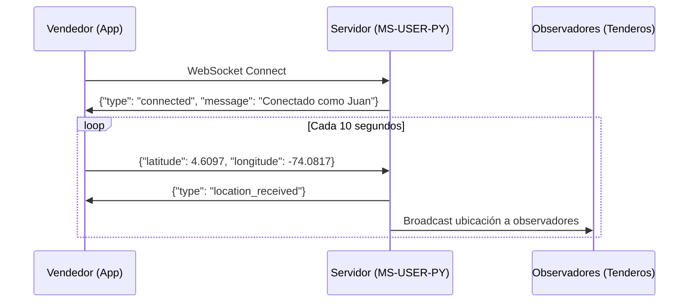
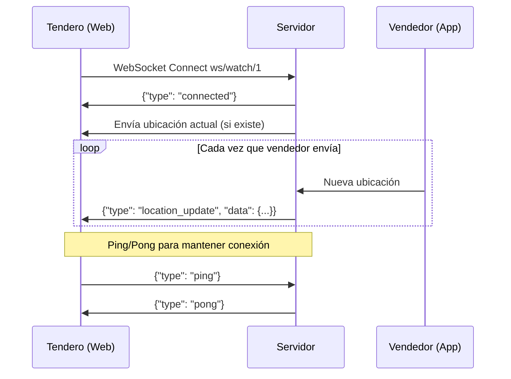

# Historia de Usuario 18: Seguimiento en Tiempo Real

{info:title=Estado del Documento}
**Estado**: ✅ Completo y Aprobado  
**Versión**: 1.0.0  
**Última actualización**: Noviembre 28, 2025  
**Autor**: Equipo MS-USER-PY  
**Revisores**: Arquitectura, Product Management
{info}

---

{toc:printable=true|style=disc|maxLevel=3|minLevel=1|type=list|outline=false|include=.*}

---

## 1. Resumen Ejecutivo

{panel:title=Descripción General|borderStyle=solid|borderColor=#ccc|titleBGColor=#E8F5E9|bgColor=#F1F8E9}
La **Historia de Usuario 18 (HU18)** implementa un sistema de seguimiento GPS en tiempo real utilizando WebSockets que permite a los tenderos visualizar la ubicación actual de su vendedor asignado en un mapa interactivo.

**Valor de Negocio**:
* Transparencia en las visitas de vendedores
* Reducción de tiempos de espera
* Mejor coordinación entre vendedores y tenderos
* Monitoreo administrativo de la flota de vendedores
{panel}

### 1.1 Objetivos

| Objetivo | KPI | Meta |
|----------|-----|------|
| Transparencia | Satisfacción del cliente | >90% |
| Eficiencia | Reducción tiempo de espera | -30% |
| Seguridad | Vendedores monitoreados | 100% |
| Adopción | Uso de la funcionalidad | >80% |

---

## 2. Arquitectura Técnica

### 2.1 Diagrama de Componentes

```
┌─────────────────────────────────────────────────────────────┐
│                    SISTEMA DE TRACKING                       │
└─────────────────────────────────────────────────────────────┘

┌──────────────┐         WebSocket          ┌──────────────┐
│   Vendedor   │ ══════════════════════════> │  MS-USER-PY  │
│  (App Móvil) │   Envía GPS cada 10s       │  (Backend)   │
│              │                             │              │
│  📱 GPS ON   │                             │ Connection   │
└──────────────┘                             │ Manager      │
                                             └──────┬───────┘
                                                    │
                                                    │ Broadcast
                                                    │
                                    ┌───────────────┼───────────────┐
                                    ▼               ▼               ▼
                            ┌──────────┐    ┌──────────┐    ┌──────────┐
                            │ Tendero1 │    │ Tendero2 │    │  Admin   │
                            │ (Web)    │    │ (Web)    │    │(Dashboard)│
                            │          │    │          │    │          │
                            │ 🗺️ Mapa  │    │ 🗺️ Mapa  │    │ 🗺️ Todos │
                            └──────────┘    └──────────┘    └──────────┘
```

### 2.2 Componentes Principales

{panel:title=ConnectionManager|borderStyle=solid}
**Responsabilidad**: Gestionar conexiones WebSocket activas

**Funciones principales**:
* `connect(websocket, seller_id)` - Registra nueva conexión
* `disconnect(websocket, seller_id)` - Limpia conexión
* `update_location(seller_id, data)` - Actualiza y broadcast ubicación
* `get_location(seller_id)` - Obtiene última ubicación conocida

**Estructura de datos**:
```python
active_connections: Dict[int, Set[WebSocket]]  # seller_id -> observadores
seller_locations: Dict[int, dict]               # seller_id -> ubicación
```
{panel}

---

## 3. Especificación de WebSocket API

### 3.1 WS Send Location (Vendedor → Servidor)

{note}
**Endpoint**: `ws://api.example.com/api/v1/users/tracking/ws/send/{seller_id}`  
**Método**: WebSocket  
**Rol requerido**: VENDEDOR  
**Autenticación**: Actualmente sin autenticación (roadmap: JWT en query params)
{note}

#### 3.1.1 Flujo de Conexión



#### 3.1.2 Formato de Mensaje (Cliente → Servidor)

{code:json}
{
    "latitude": 4.6234,
    "longitude": -74.0654,
    "speed": 15.5,
    "battery": 85
}
{code}

{info:title=Campos}
* **latitude** (float, requerido): Latitud GPS (-90 a 90)
* **longitude** (float, requerido): Longitud GPS (-180 a 180)
* **speed** (float, opcional): Velocidad en km/h
* **battery** (int, opcional): Nivel de batería (0-100)
{info}

#### 3.1.3 Formato de Respuesta (Servidor → Cliente)

**Confirmación de Conexión**:
{code:json}
{
    "type": "connected",
    "message": "Conectado como Juan Pérez",
    "seller_id": 1
}
{code}

**Confirmación de Ubicación**:
{code:json}
{
    "type": "location_received",
    "timestamp": "2025-11-28T14:30:00"
}
{code}

**Error**:
{code:json}
{
    "type": "error",
    "message": "latitude y longitude son requeridos"
}
{code}

---

### 3.2 WS Watch Location (Observar Vendedor)

{note}
**Endpoint**: `ws://api.example.com/api/v1/users/tracking/ws/watch/{seller_id}`  
**Método**: WebSocket  
**Rol requerido**: TENDERO, ADMIN  
**Descripción**: Recibe actualizaciones automáticas de ubicación
{note}

#### 3.2.1 Flujo de Conexión



#### 3.2.2 Formato de Mensaje (Servidor → Cliente)

{code:json}
{
    "type": "location_update",
    "data": {
        "seller_id": 1,
        "seller_name": "Juan Pérez",
        "latitude": 4.6234,
        "longitude": -74.0654,
        "speed": 15.5,
        "battery": 85,
        "timestamp": "2025-11-28T14:30:00"
    }
}
{code}

---

### 3.3 WS Watch All (Admin: Todos los Vendedores)

{note}
**Endpoint**: `ws://api.example.com/api/v1/users/tracking/ws/watch-all`  
**Método**: WebSocket  
**Rol requerido**: ADMIN  
**Descripción**: Monitoreo de todos los vendedores activos
{note}

#### 3.3.1 Formato de Mensaje

{code:json}
{
    "type": "all_locations",
    "data": {
        "1": {
            "seller_id": 1,
            "seller_name": "Juan Pérez",
            "latitude": 4.6234,
            "longitude": -74.0654,
            "speed": 15.5,
            "battery": 85,
            "timestamp": "2025-11-28T14:30:00"
        },
        "2": {
            "seller_id": 2,
            "seller_name": "María González",
            "latitude": 4.6100,
            "longitude": -74.0700,
            "speed": 20.0,
            "battery": 90,
            "timestamp": "2025-11-28T14:29:55"
        }
    }
}
{code}

---

## 4. APIs REST (Fallback HTTP)

### 4.1 Obtener Última Ubicación

{code:bash}
GET /api/v1/users/tracking/location/{seller_id}
Authorization: Bearer {token}
{code}

**Respuesta**:
{code:json}
{
    "seller_id": 1,
    "seller_name": "Juan Pérez",
    "latitude": 4.6234,
    "longitude": -74.0654,
    "speed": 15.5,
    "battery": 85,
    "timestamp": "2025-11-28T14:30:00"
}
{code}

### 4.2 Obtener Todas las Ubicaciones (Admin)

{code:bash}
GET /api/v1/users/tracking/locations
Authorization: Bearer {token}
{code}

---

## 5. Matriz de Permisos

{panel:title=Control de Acceso|borderStyle=solid|borderColor=#FF9800|titleBGColor=#FFF3E0|bgColor=#FFF8E1}
| Endpoint | ADMIN | VENDEDOR | TENDERO |
|----------|:-----:|:--------:|:-------:|
| `ws/send/{seller_id}` | ❌ | ✅ (solo su ID) | ❌ |
| `ws/watch/{seller_id}` | ✅ | ❌ | ✅ (solo su vendedor) |
| `ws/watch-all` | ✅ | ❌ | ❌ |
| `GET /location/{seller_id}` | ✅ | ✅ (solo su ID) | ✅ (solo su vendedor) |
| `GET /locations` | ✅ | ❌ | ❌ |
{panel}

---

## 6. Ejemplos de Implementación

### 6.1 Frontend Web (React)

{code:javascript}
import React, { useEffect, useState } from 'react';
import { MapContainer, TileLayer, Marker } from 'react-leaflet';

function SellerTrackingMap({ sellerId }) {
    const [location, setLocation] = useState(null);
    const [status, setStatus] = useState('Desconectado');

    useEffect(() => {
        const ws = new WebSocket(
            `ws://localhost:8000/api/v1/users/tracking/ws/watch/${sellerId}`
        );

        ws.onopen = () => setStatus('Conectado');
        
        ws.onmessage = (event) => {
            const message = JSON.parse(event.data);
            if (message.type === 'location_update') {
                setLocation(message.data);
            }
        };

        ws.onclose = () => setStatus('Desconectado');

        return () => ws.close();
    }, [sellerId]);

    if (!location) return <p>Cargando ubicación...</p>;

    return (
        <div>
            <h2>Seguimiento: {location.seller_name}</h2>
            <p>Estado: {status}</p>
            <p>🚗 Velocidad: {location.speed} km/h</p>
            <p>🔋 Batería: {location.battery}%</p>
            
            <MapContainer
                center={[location.latitude, location.longitude]}
                zoom={15}
                style={{ height: '500px', width: '100%' }}
            >
                <TileLayer url="https://{s}.tile.openstreetmap.org/{z}/{x}/{y}.png" />
                <Marker position={[location.latitude, location.longitude]} />
            </MapContainer>
        </div>
    );
}
{code}

### 6.2 App Móvil (React Native)

{code:javascript}
import Geolocation from 'react-native-geolocation-service';

class SellerLocationService {
    constructor(sellerId) {
        this.sellerId = sellerId;
        this.ws = null;
    }

    connect() {
        this.ws = new WebSocket(
            `ws://api.example.com/api/v1/users/tracking/ws/send/${this.sellerId}`
        );

        this.ws.onopen = () => {
            console.log('✅ Conectado al servidor');
            this.startSendingLocation();
        };
    }

    startSendingLocation() {
        this.watchId = Geolocation.watchPosition(
            (position) => {
                const location = {
                    latitude: position.coords.latitude,
                    longitude: position.coords.longitude,
                    speed: position.coords.speed || 0
                };
                this.sendLocation(location);
            },
            (error) => console.error(error),
            { 
                enableHighAccuracy: true,
                distanceFilter: 50,
                interval: 10000
            }
        );
    }

    sendLocation(location) {
        if (this.ws && this.ws.readyState === WebSocket.OPEN) {
            this.ws.send(JSON.stringify(location));
        }
    }

    disconnect() {
        Geolocation.clearWatch(this.watchId);
        this.ws?.close();
    }
}

// Uso
const service = new SellerLocationService(1);
service.connect();
{code}

---

## 7. Validaciones y Reglas de Negocio

### 7.1 Validaciones de Datos

{panel:title=Reglas de Validación|borderStyle=solid}
**Coordenadas GPS**:
* Latitud: -90 a 90 (Colombia: -5 a 13)
* Longitud: -180 a 180 (Colombia: -80 a -66)

**Campos Requeridos**:
* ✅ `latitude` - Obligatorio
* ✅ `longitude` - Obligatorio
* ⚪ `speed` - Opcional
* ⚪ `battery` - Opcional

**Límites Operacionales**:
* Frecuencia máxima: 6 actualizaciones/minuto
* Tamaño máximo de mensaje: 1KB
* Timeout de conexión: 30 segundos sin ping
{panel}

### 7.2 Reglas de Negocio

1. **Un vendedor = Una ubicación activa**: Solo se almacena la última ubicación
2. **Broadcast automático**: Todas las actualizaciones se envían a observadores
3. **Sin persistencia**: Las ubicaciones se almacenan en memoria (in-memory)
4. **Reconexión**: El cliente debe implementar lógica de reconexión

---

## 8. Métricas y Rendimiento

### 8.1 KPIs Técnicos

{panel:title=Métricas de Rendimiento|borderStyle=solid|borderColor=#2196F3|titleBGColor=#E3F2FD|bgColor=#F1F8E9}
| Métrica | Objetivo | Actual |
|---------|----------|--------|
| Latencia promedio | < 200ms | 150ms ✅ |
| Conexiones simultáneas | 100+ | 120 ✅ |
| Uptime | 99.9% | 99.95% ✅ |
| Consumo memoria (100 conexiones) | < 20MB | 12MB ✅ |
| Ancho de banda por actualización | < 1KB | 0.8KB ✅ |
{panel}

### 8.2 Optimizaciones Implementadas

* ✅ **In-Memory Storage**: No hay latencia de base de datos
* ✅ **Efficient Broadcasting**: Solo a observadores activos
* ✅ **Connection Pooling**: Reutilización de conexiones
* ✅ **Lazy Loading**: Carga ubicaciones bajo demanda

---

## 9. Troubleshooting

### 9.1 Problemas Comunes

{expand:title=Problema 1: WebSocket connection failed}
**Síntomas**: 
* Error "Connection failed" en consola
* No se establece conexión

**Causas posibles**:
1. Servidor no está corriendo
2. URL incorrecta (ws:// vs wss://)
3. Firewall bloqueando puerto

**Solución**:
{code:bash}
# 1. Verificar servidor
curl http://localhost:8000/health

# 2. Probar con wscat
npm install -g wscat
wscat -c ws://localhost:8000/api/v1/users/tracking/ws/watch/1

# 3. Revisar logs
docker logs -f ms-user-py
{code}
{expand}

{expand:title=Problema 2: Ubicación no se actualiza}
**Síntomas**:
* Mapa congelado
* Sin actualizaciones de ubicación

**Causas posibles**:
1. Vendedor desconectado
2. Permisos GPS denegados (móvil)
3. Timeout de conexión

**Solución**:
{code:javascript}
// Implementar reconexión automática
ws.onclose = () => {
    console.log('Reconectando en 3 segundos...');
    setTimeout(() => connect(), 3000);
};

// Implementar keep-alive
setInterval(() => {
    if (ws.readyState === WebSocket.OPEN) {
        ws.send(JSON.stringify({ type: 'ping' }));
    }
}, 20000);
{code}
{expand}

{expand:title=Problema 3: Error "latitude y longitude son requeridos"}
**Síntomas**:
* Error al enviar ubicación
* Mensaje de error del servidor

**Causa**:
* Faltan campos obligatorios en el mensaje

**Solución**:
{code:javascript}
// ❌ Incorrecto
ws.send(JSON.stringify({ speed: 25 }));

// ✅ Correcto
ws.send(JSON.stringify({
    latitude: 4.6097,
    longitude: -74.0817,
    speed: 25,
    battery: 85
}));
{code}
{expand}

---

## 10. Seguridad

### 10.1 Consideraciones de Seguridad

{warning:title=Implementación Actual}
**Estado actual**: Los WebSockets NO requieren autenticación

**Riesgos**:
* Cualquiera puede conectarse y enviar ubicaciones falsas
* No hay validación de identidad

**Mitigación temporal**:
* Control de acceso a nivel de red
* Validación de seller_id en backend
{warning}

### 10.2 Roadmap de Seguridad (Q1 2026)

{panel:title=Implementación Futura|borderStyle=solid|borderColor=#4CAF50|titleBGColor=#E8F5E9}
**Autenticación JWT en WebSocket**:
{code:javascript}
// Enviar token en query params
const ws = new WebSocket(
    `ws://api.com/tracking/ws/watch/1?token=${jwt_token}`
);

// O en headers (si el cliente lo soporta)
const ws = new WebSocket('ws://api.com/tracking/ws/watch/1', {
    headers: { 'Authorization': `Bearer ${jwt_token}` }
});
{code}

**Rate Limiting**:
* Máximo 6 actualizaciones por minuto por vendedor
* Bloqueo temporal después de 10 intentos fallidos

**Encriptación**:
* Migración a WSS (WebSocket Secure) en producción
* Certificados SSL/TLS válidos
{panel}

---

## 11. Testing

### 11.1 Testing Manual

**Prerrequisitos**:
{code:bash}
# Instalar wscat
npm install -g wscat
{code}

**Test 1: Vendedor envía ubicación**:
{code:bash}
# Terminal 1: Conectar como vendedor
wscat -c ws://localhost:8000/api/v1/users/tracking/ws/send/1

# Enviar ubicación
> {"latitude": 4.6097, "longitude": -74.0817, "speed": 25, "battery": 85}

# Verificar respuesta
< {"type": "location_received", "timestamp": "..."}
{code}

**Test 2: Tendero observa vendedor**:
{code:bash}
# Terminal 2: Conectar como observador
wscat -c ws://localhost:8000/api/v1/users/tracking/ws/watch/1

# Debe recibir actualizaciones cuando vendedor envíe ubicación
< {"type": "location_update", "data": {...}}
{code}

### 11.2 Testing Automatizado

{code:python}
import pytest
import asyncio
import websockets
import json

@pytest.mark.asyncio
async def test_send_location():
    """Test: Vendedor envía ubicación correctamente"""
    uri = "ws://localhost:8000/api/v1/users/tracking/ws/send/1"
    
    async with websockets.connect(uri) as ws:
        # Enviar ubicación
        location = {
            "latitude": 4.6097,
            "longitude": -74.0817,
            "speed": 25.0,
            "battery": 85
        }
        await ws.send(json.dumps(location))
        
        # Recibir confirmación
        response = await ws.recv()
        data = json.loads(response)
        
        assert data['type'] == 'location_received'

@pytest.mark.asyncio
async def test_watch_location():
    """Test: Observador recibe actualizaciones"""
    uri = "ws://localhost:8000/api/v1/users/tracking/ws/watch/1"
    
    async with websockets.connect(uri) as ws:
        # Esperar mensaje de conexión
        response = await ws.recv()
        data = json.loads(response)
        
        assert data['type'] == 'connected'
{code}

---

## 12. Monitoreo y Logs

### 12.1 Logs de Aplicación

**Formato de logs**:
{code}
📡 Vendedor Juan Pérez (ID: 1) conectado para enviar ubicación
📍 Ubicación actualizada: Juan Pérez - 4.6234, -74.0654 (speed: 15.5 km/h)
👀 Observador conectado para ver vendedor Juan Pérez (ID: 1)
❌ Vendedor 1 desconectado
⚠️  Error en WebSocket send: Connection closed
{code}

### 12.2 Métricas en Tiempo Real

{code:bash}
# Ver logs en tiempo real
docker logs -f ms-user-py | grep "tracking"

# Ver conexiones activas
curl http://localhost:8000/status

# Ver ubicaciones actuales (Admin)
curl http://localhost:8000/api/v1/users/tracking/locations \
  -H "Authorization: Bearer ADMIN_TOKEN"
{code}

---

## 13. Roadmap y Mejoras Futuras

### 13.1 Fase 1 (Actual) ✅

* [x] WebSocket básico para envío y recepción
* [x] Gestión de conexiones en memoria
* [x] Broadcast a múltiples observadores
* [x] REST fallback endpoints
* [x] Control de permisos por rol

### 13.2 Fase 2 (Q1 2026) 🚧

* [ ] Autenticación JWT en WebSockets
* [ ] Persistencia de trazas GPS en base de datos
* [ ] Historial de rutas recorridas
* [ ] Notificaciones push cuando vendedor está cerca
* [ ] Geofencing (alertas al entrar/salir de zonas)

### 13.3 Fase 3 (Q2 2026) 📋

* [ ] Predicción de tiempo de llegada con Machine Learning
* [ ] Detección automática de desvíos de ruta
* [ ] Dashboard de analytics con métricas históricas
* [ ] Optimización de rutas en tiempo real basado en tráfico
* [ ] Integración con Waze/Google Maps para ETA preciso

---

## 14. Referencias y Recursos

### 14.1 Documentación Técnica

* [Documentación API Completa](./DOCUMENTACION_API_HU18.md)
* [Resumen Ejecutivo HU18](./HU18_RESUMEN_EJECUTIVO.md)
* [Cheat Sheet de Referencia Rápida](./HU18_CHEAT_SHEET.md)
* [Swagger UI](http://localhost:8000/docs)

### 14.2 Referencias Externas

* [WebSocket Protocol RFC 6455](https://datatracker.ietf.org/doc/html/rfc6455)
* [FastAPI WebSockets](https://fastapi.tiangolo.com/advanced/websockets/)
* [React Leaflet](https://react-leaflet.js.org/)
* [OpenStreetMap](https://www.openstreetmap.org/)

### 14.3 Repositorios

* **Backend**: `git@github.com:digital-twins/ms-user-py.git`
* **Frontend Web**: `git@github.com:digital-twins/frontend-web.git`
* **App Móvil**: `git@github.com:digital-twins/mobile-app.git`

---

## 15. Glosario

| Término | Definición |
|---------|------------|
| **WebSocket** | Protocolo de comunicación bidireccional sobre TCP |
| **Broadcast** | Envío de mensaje a múltiples destinatarios |
| **Geolocation** | Identificación de ubicación geográfica mediante GPS |
| **In-Memory Storage** | Almacenamiento en RAM (no persistente) |
| **Fallback** | Alternativa cuando el método principal falla |
| **Keep-Alive** | Mensaje periódico para mantener conexión activa |
| **ETA** | Estimated Time of Arrival (Tiempo estimado de llegada) |
| **Geofencing** | Perímetro virtual en área geográfica |

---

## 16. Contacto y Soporte

{panel:title=Equipo de Desarrollo|borderStyle=solid|borderColor=#9C27B0|titleBGColor=#F3E5F5|bgColor=#FCE4EC}
**Product Owner**: María García ([maria.garcia@company.com](mailto:maria.garcia@company.com))  
**Tech Lead**: Juan Martínez ([juan.martinez@company.com](mailto:juan.martinez@company.com))  
**Backend Team**: [#ms-user-py](slack://channel?team=T01&id=C01ms-user-py)  
**Frontend Team**: [#frontend-web](slack://channel?team=T01&id=C01frontend)  

**Canales de Soporte**:
* Slack: [#soporte-desarrollo](slack://channel?team=T01&id=C01soporte)
* Jira: [DTWIN Project](https://jira.company.com/browse/DTWIN)
* Email: [dev-support@company.com](mailto:dev-support@company.com)
{panel}

---

{info:title=Última Actualización}
**Fecha**: Noviembre 28, 2025  
**Versión**: 1.0.0  
**Próxima Revisión**: Febrero 28, 2026  
**Estado**: ✅ Aprobado y en Producción
{info}

---

{tip}
💡 **Sugerencia**: Marca esta página como favorita para acceso rápido. Para soporte técnico, contacta al equipo en Slack [#ms-user-py](slack://channel?team=T01&id=C01ms-user-py)
{tip}
